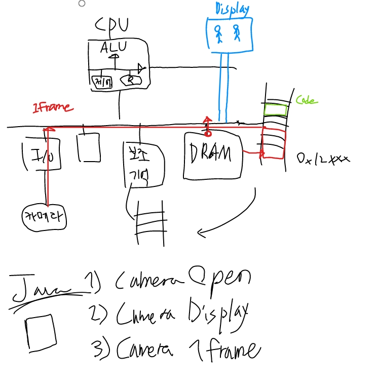
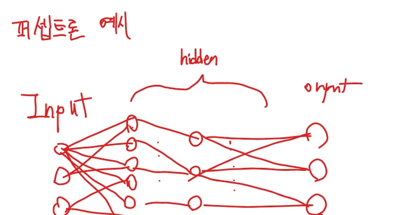
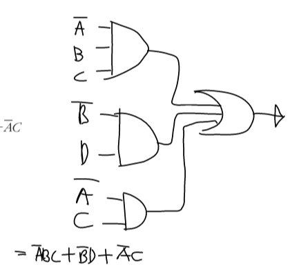
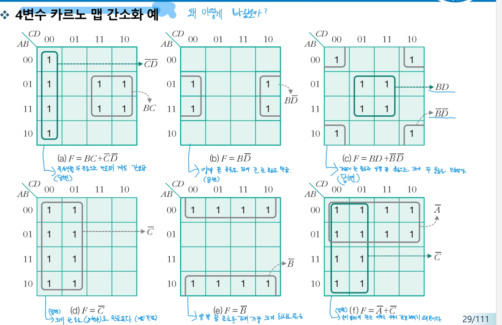
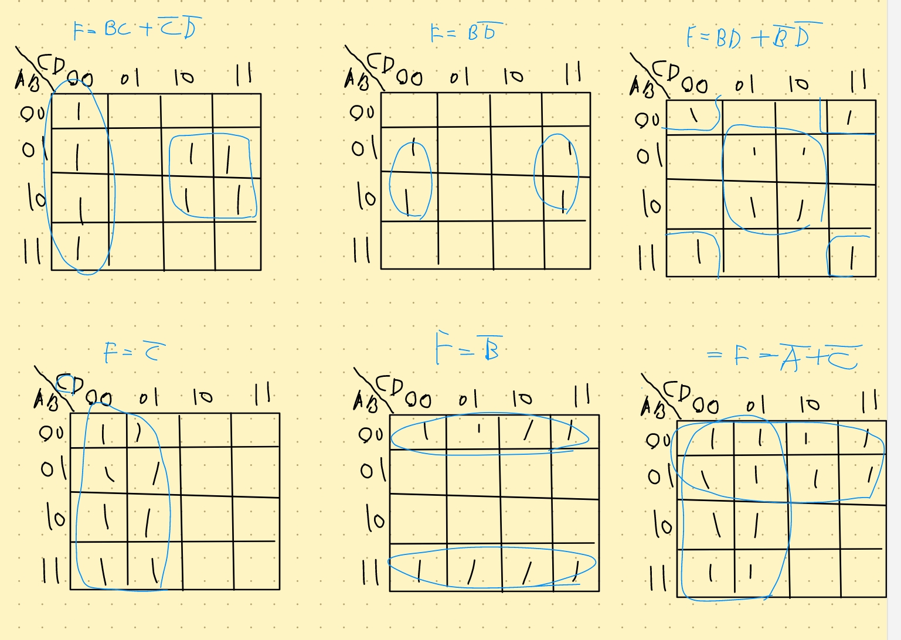

# 3월 22일

1. 왜 단방향이 존재할까? 버스를 모두 양방향으로 하면 안될까?

답변: 

단방향 버스와 양방향 버스 각각의 장점이 있다. 단방향 버스는 구조가 단순하고, 데이터 전송이 한 방향으로만 이루어지기 때문에 데이터 충돌을 방지할 수 있다. 반면에 양방향 버스는 데이터를 양방향으로 전송할 수 있어, 데이터 전송 효율이 높다. 그러나 데이터 전송 방향을 제어해야 하므로 회로 구조가 복잡해질 수 있다. 따라서, 버스를 모두 양방향으로 만들면 데이터 전송 효율은 높아질 수 있지만, 회로 구조가 복잡해지고 데이터 충돌 가능성이 증가할 수 있다. 이러한 이유로, 컴퓨터 시스템에서는 데이터 전송의 특성에 따라 단방향 버스와 양방향 버스를 적절하게 사용한다.

컴퓨터 구조 그려보기

퍼셉트론(인공지능)의 예시

2. 폰 노이만 구조는 정확히 뭐를 말하는걸까?

답변: 

폰 노이만 구조는 컴퓨터 아키텍처의 중요한 개념 중 하나로, 컴퓨터 시스템의 설계와 동작 원리를 설명하는 기본적인 프레임워크이다.  구조는 중앙처리장치 (CPU), 메모리, 그리고 프로그램 세 가지 주요 요소로 구성되어 있다. CPU와 메모리는 서로 분리되어 있으며, 둘을 연결하는 버스를 통해 명령어 읽기, 데이터의 읽고 쓰기가 가능하다. 이러한 분리된 구조는 명령어와 데이터를 동시에 접근할 수 없게 한다. 이는 메모리 안에 프로그램과 데이터 영역이 물리적 구분이 없기 때문에 명령어와 데이터가 같은 메모리, 버스를 사용하게 된다. 이전 컴퓨터는 ‘1+1’, ‘3-2’ 라는 두 가지의 명령을 수행하려면 하드웨어의 전선을 직접 1, 더하기, 1, 3, 빼기, 2를 의미하는 것으로 매번 바꿔 끼워 입력해야 했지만 폰 노이만 구조에서는 더하기, 빼기 기능을 담은 소프트웨어가 메모리 안에 내장되어 있다. 그래서 계산이 필요할 때마다 메모리 안의 프로그램과 데이터를 CPU에 전달하여 계산을 처리한다.

3. 폰노이만 구조에서 병목 현상은 왜 일어나는 걸까?

답변: 이 현상은 프로그램 메모리와 데이터 메모리가 물리적 구분 없이 하나의 버스를 통해 CPU와 교류하기 때문에 발생한다. 이로 인해 CPU는 명령어와 데이터에 동시에 접근이 불가능하고 나열된 명령을 한 번에 하나씩 읽고 쓰게 된. 이는 기억장치의 속도가 전체 시스템의 성능 저하를 야기하는 병목현상 또는 기억장소의 지연 현상을 이른다.

4. TTL과 CMOS는 뭘까?

답변: TTL (Transistor-Transistor Logic)과 CMOS (Complementary Metal-Oxide-Semiconductor)는 디지털 회로를 구성하는 두 가지 주요 기술이다. TTL은 트랜지스터와 트랜지스터를 이어 붙여 구현되며, 일반적으로 5V 단일 전원을 사용하는 반도체이다. TTL은 BJT (Bipolar Junction Transistor)를 사용하여 만들어지며, 소비 전력이 크지만 동작 속도가 빠른 것이 특징이다. 그러나, 집적률이 높아질 수 없는 단점이 있다. CMOS는 P-채널과 N-채널이 각각 직렬로 구성되며, 전류 요구 사항이 낮아 전력 소비가 제한되고 회로가 더 저렴하며 전력 관리를 위해 설계하기 쉽다. CMOS는 소비 전력이 매우 적고 잡음 여유도가 크다는 것이 더욱 유리하지만, 동작 속도가 느리다는 것이 치명적인 단점이다.

곱의 합과 최소항 회로 그려보기

왜 카르노 맵이 이렇게 나왔을까?

